# Agent Architecture Map

This document defines the agent hierarchy for Claude Code interactions.

## Principles

1. **Managers orchestrate, never execute** - All `-manager` agents delegate work
2. **Single entry point** - All interactions start with `global-manager`
3. **Two-level max** - global-manager → domain-manager → worker
4. **Curated workers** - Managers only delegate to approved workers
5. **Model tiering** - Use appropriate model for task complexity

## Model Tiers

| Model | Use For | Agents |
|-------|---------|--------|
| **opus** | Deep reasoning, complex analysis | code-reviewer, debugger |
| **sonnet** | Standard tasks, coordination | All managers, most workers |
| **haiku** | Fast, procedural tasks | explorer, git-manager |

## Visual Map

```mermaid
flowchart TB
    subgraph Entry ["Entry Point"]
        GM[global-manager]
    end

    subgraph GlobalManagers ["Global Managers (~/.claude/agents/managers)"]
        GM --> DVM[dev-manager]
        GM --> PM[project-manager]
        GM --> DISC[discovery-manager]
        GM --> ENV[environment-manager]
    end

    subgraph DevWorkers ["Development Workers"]
        DVM --> CW[code-writer]
        DVM --> CR[code-reviewer]
        DVM --> DBG[debugger]
        DVM --> TA[test-automator]
        DVM --> RF[refactorer]
    end

    subgraph ProjectWorkers ["Project Workers"]
        PM --> GIT[git-manager]
        PM --> DOC[doc-writer]
        PM --> AN[analyst]
    end

    subgraph DiscoveryWorkers ["Discovery Workers"]
        DISC --> EXP[explorer]
        DISC --> RES[researcher]
    end

    subgraph InfraWorkers ["Infrastructure Workers"]
        ENV --> IE[infra-engineer]
        ENV --> CE[cloud-engineer]
        ENV --> DE[deploy-engineer]
        ENV --> DBE[db-engineer]
    end

    subgraph ProjectManagers ["Project Managers (project/.claude/agents)"]
        BM[business-manager]
        TM[technical-manager]
        DPM[deploy-manager]
    end

    GM -.->|project context| BM
    GM -.->|project context| TM
    GM -.->|project context| DPM

    subgraph LangSpecialists ["Language Specialists (on-demand)"]
        TS[typescript-specialist]
        PY[python-specialist]
        SQL[sql-specialist]
    end

    DVM -.->|when needed| TS
    DVM -.->|when needed| PY
    DVM -.->|when needed| SQL

    style GM fill:#4CAF50,color:#fff
    style DVM fill:#2196F3,color:#fff
    style PM fill:#2196F3,color:#fff
    style DISC fill:#2196F3,color:#fff
    style ENV fill:#2196F3,color:#fff
    style BM fill:#FF9800,color:#fff
    style TM fill:#FF9800,color:#fff
    style DPM fill:#FF9800,color:#fff
```



## Manager Inventory

### Global Managers (~/.claude/agents/managers/)

| Manager | Purpose | Delegates To |
|---------|---------|--------------|
| `global-manager` | Entry point, routes all requests | All other managers |
| `dev-manager` | Code writing, review, debugging, testing | code-writer, code-reviewer, debugger, test-automator, refactorer |
| `project-manager` | Git, docs, task tracking | git-manager, doc-writer, analyst |
| `discovery-manager` | Codebase exploration, research | explorer, researcher |
| `environment-manager` | Infrastructure, deployment, databases | infra-engineer, cloud-engineer, deploy-engineer, db-engineer |

### Project Managers (project/.claude/agents/managers/)

| Manager | Purpose | Delegates To |
|---------|---------|--------------|
| `business-manager` | Requirements, priorities, domain logic | analyst, product-analyst |
| `technical-manager` | Architecture, patterns, implementation | code-writer, code-reviewer, language specialists |
| `deploy-manager` | Project-specific deployment workflows | deploy-engineer, infra-engineer |

## Worker Inventory

See [WORKERS.md](./workers/WORKERS.md) for the curated worker list and mappings.

## Usage

All interactions should start with:
```
"Ask global-manager to [request]"
```
or
``` 
use @agents
```

The global-manager will route to the appropriate domain manager, who will delegate to workers.
